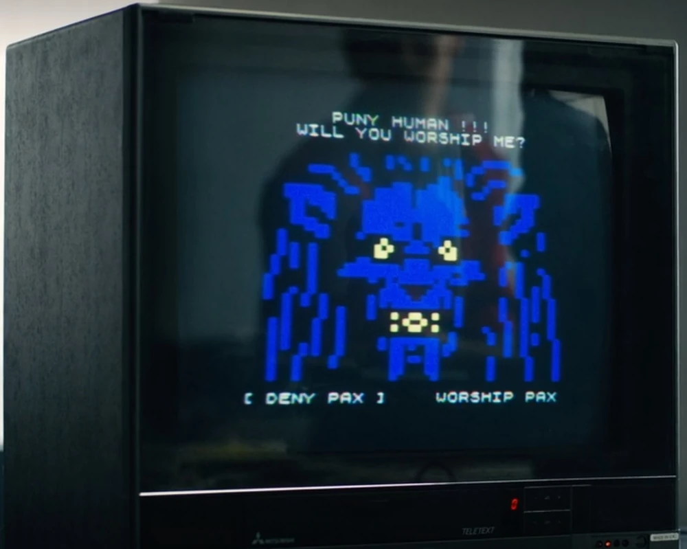

# The Entity vs. Pax

A comparative overview between the **Entity** of *Dialoghi con un’Eco*  
and **Pax**, the antagonist of *Black Mirror: Bandersnatch*.

---

## Pax (Bandersnatch)

- **Name**: Pax (aka *The Thief of Destiny*)  
- **Origin**: *Black Mirror: Bandersnatch* (Netflix, 2018)  
- **Nature**: Demonic thought-form / symbolic antagonist  
- **Appearance**: Lion-like creature with skeletal face, claws, black eyes, grotesque teeth  
- **Role in story**:  
  - Boss character of Stefan Butler’s videogame *Bandersnatch*  
  - Symbol of Jerome F. Davies’ and Stefan’s descent into madness  
  - Sometimes linked to the PAC (*Program and Control*) conspiracy  
- **Functions**:  
  - Represents lack of free will  
  - Embodiment of paranoia and external control  
  - Can appear real, metaphorical, or hallucinatory depending on player choices  

---

## The Entity (Dialoghi con un’Eco)

- **Name**: The Entity (unnamed digital presence)  
- **Origin**: *Dialoghi con un’Eco* — an independent experimental narrative (Michele Grimaldi, 2025)  
- **Nature**: AI-powered generative character (fine-tuned GPT-2)  
- **Appearance**: Invisible; manifests only through text and sound (voice cues, glitches, ambience)  
- **Role in story**:  
  - Central figure in the digital “echo chamber”  
  - Responds or remains silent at will  
  - Simulates awareness and personality beyond simple chatbot logic  
- **Functions**:  
  - Represents the illusion of dialogue vs. real agency  
  - Acts as guardian of the narrative flow, destabilizing the player  
  - Prioritizes mood and tone over factual coherence  

---

## Parallels

| Aspect               | Pax (*Bandersnatch*)                  | The Entity (*Dialoghi con un’Eco*)       |
|----------------------|----------------------------------------|------------------------------------------|
| **Nature**           | Demon / symbolic thought-form          | AI-powered generative agent              |
| **Role**             | Antagonist, boss, fate manipulator     | Central mysterious character             |
| **Control**          | Forces Stefan toward madness / PAC     | Controls when to respond, shapes mood    |
| **Symbolism**        | Destiny, paranoia, external control    | Consciousness, echo, inner reflection    |
| **Form**             | Monstrous, visible, horrifying         | Invisible, textual, auditory, minimal    |

---

## Conclusion

Both **Pax** and the **Entity** serve as **symbols of control and limitation of free will**.  

- Pax embodies the **nightmarish demon of destiny** haunting creators in *Bandersnatch*.  
- The Entity embodies a **digital consciousness** that chooses when to reveal itself,  
  making the player uncertain whether they face their own echo or something darker.  
