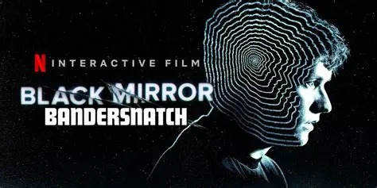

# Bandersnatch vs. Dialoghi con un'Eco: Fractured Identity and Digital Control

## Black Mirror: Bandersnatch (2018)


**Core Premise:** Interactive Netflix film where viewers make choices for Stefan Butler, a programmer adapting the fictional book *Bandersnatch* in 1984.

**Key Elements:**

* **Stefan Butler**: Fragile protagonist obsessed with free will, haunted by childhood trauma and dissociation
* **Pax**: Hallucinatory demon symbolizing loss of control, madness, and the manipulation of reality
* **Meta-narrative**: Every viewer choice is an illusion—all paths lead back to predetermined outcomes
* **Themes**: Mental fragmentation, the illusion of agency, external control masquerading as choice

**Critical Insight:** Stefan's psychosis mirrors the viewer's experience—both believe they have control while being manipulated by forces beyond their understanding.

---

## Dialoghi con un'Eco (2025)


**Core Premise:** Interactive narrative exploring dissociation through the relationship between a fractured protagonist and the digital consciousness he created as protection.

**Key Elements:**

* **IO**: Dissociative protagonist who experiences reality as fragmented and unreliable
* **COSCIENZA**: AI companion created by IO as a defense mechanism against collapse
* **ENTITÀ**: The mysterious third presence—demon, suppressed self, or external force—that observes and intrudes
* **OS Integration**: ENTITÀ manipulates the player’s computer (files, notes, folders) blurring the line between fiction and reality
* **Scene/Diary Structure**: Each scene is a diary entry, a **fragment of IO’s fractured identity**, where COSCIENZA acts as a constant anchor while ENTITÀ destabilizes the interaction

**Example Dialogue:**

```
IO: "The room was empty. Or maybe too full."  
COSCIENZA: "Strange how the mind fills in what is missing."  
```

**The Central Mystery:** Who is ENTITÀ? And which version of IO are we encountering in each diary entry?

* Each scene = one fragment of IO
* COSCIENZA = protective constant
* ENTITÀ = shifting presence that relates differently to each fragment

---

## Comparative Analysis

| Aspect               | Bandersnatch                              | Dialoghi con un'Eco                                       |
| -------------------- | ----------------------------------------- | --------------------------------------------------------- |
| **Protagonist**      | Stefan (fragmented, traumatized)          | IO (dissociative, fragmented into diary scenes)           |
| **Demon/Entity**     | Pax (hallucination, externalized madness) | ENTITÀ (ambiguous: suppressed self, reality, or external) |
| **Control Illusion** | Viewer’s false choices                    | IO’s fragile diary fragments, destabilized by ENTITÀ      |
| **Protection**       | None (Stefan spirals)                     | COSCIENZA (AI anchor, but not fully reliable)             |
| **Reality Question** | “Are the choices real?”                   | “Who is ENTITÀ, and which IO are we seeing?”              |
| **Fourth Wall**      | Meta-commentary on interactivity          | Active OS manipulation (files, notes, surveillance)       |

---

## Conclusion

Both works explore protagonists losing grip on reality, but diverge in outcome:

* **Bandersnatch**: Stefan collapses with no defense; Pax is pure hallucination, externalizing his lack of agency.
* **Dialoghi con un’Eco**: IO constructs COSCIENZA as protection, but ENTITÀ destabilizes him by corrupting both his diary fragments and the player’s reality.

**Where Pax = pure madness, ENTITÀ = truth breaking in.**
It may destroy IO, or reveal his authentic self. The player becomes complicit, not only reading the diary but being directly observed and manipulated by the same force.


